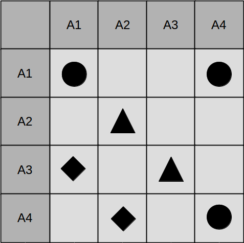

# Traceability Visualisation
This note summarizes the three most common **traceability visualisation techniques**: 
- Matrices 
- Corss-References 
- Graphs

## Traceability Matrices

Traceability Matrices visualise the traceability of *n* traced artifacts in form of a 2D grid.
This grid has at most *n²* cells.
In its most simplistic form, the coordinate *(x,y)* denotes the existence of a traceability link between artifacts x and y with a bullet.
However, using a richer set of shapes and colors, traceability matrices can provide additional information regarding the link's nature.

### Pros
- easy to understand (for simple scenarios)
- amateur friendly 

### Cons
- bloated for whole projects with thousands of artifacts (only usable for excerpts)
- it is difficult (impossibble) to visualise links between more than 2 artifacts
- it is actually hard to trace artifacts (to follow links recursively

## Traceability Cross-References
## Traceability Graphs

## References
1. [A survey of traceability in requirements engineering and model-driven development](http://dl.acm.org/citation.cfm?id=1861287), Stefan Winkler, Jens Pilgrim
