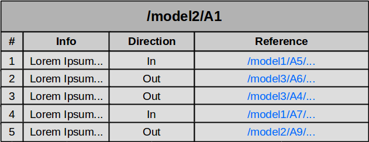

# Traceability Visualisation
This note summarizes the 3 most common traceability visualisation techniques: 
- [Traceability Matrices](#traceability-matrices)
- [Traceability Cross-References ](#traceability-cross-references)
- [Traceability Graphs](#traceability-graphs)

## Traceability Matrices

Traceability Matrices visualise the traceability of *n* traced artifacts in form of a 2D grid.
This grid has at most *n²* cells.
In its most simplistic form, the coordinate *(x,y)* denotes the existence of a traceability link between artifacts x and y with a bullet.
However, using a richer set of shapes and colors, traceability matrices can provide additional information regarding the link's nature.

### Pros
- easy to understand (for simple scenarios)
- intuitive for non-technical users

### Cons
- bloated for whole projects with thousands of artifacts (only usable for excerpts)
- it is difficult (impossibble) to visualise links between more than 2 artifacts
- it is actually hard to trace artifacts (to follow links recursively)

## Traceability Cross-References

Traceability Cross-References visualise traceability links in tabular (or textual) form.
Each artifact has its own table, containing all traceability relations it is part of.
Cross-Reference tables can vary the amount of depicted information.
The smallest common denominator are the references to linked artifacts.
Such references can be implemented as hyperlinks.
This way one can follow traces in any direction.

Cross-Reference tables can easily be aggregated to create a big table containg all traceability links of interest.

### Pros
- navigation through out a project is possible
- allows traceabiltiy links between more than 2 artifacts

### Cons
- focus is on one artifact 

## Traceability Graphs

Traceability Graphs visualise traceability links as edges and artifacts as nodes.
This a approach seems intuitive for model centric environments.

### Pros
- navigation through out a project is possible
- allows traceabiltiy links between more than 2 artifacts

### Cons
- bloated for whole projects with thousands of artifacts (only usable for excerpts)
- not intuitive for non-technical users

## References
1. [A survey of traceability in requirements engineering and model-driven development](http://dl.acm.org/citation.cfm?id=1861287), Stefan Winkler, Jens Pilgrim
